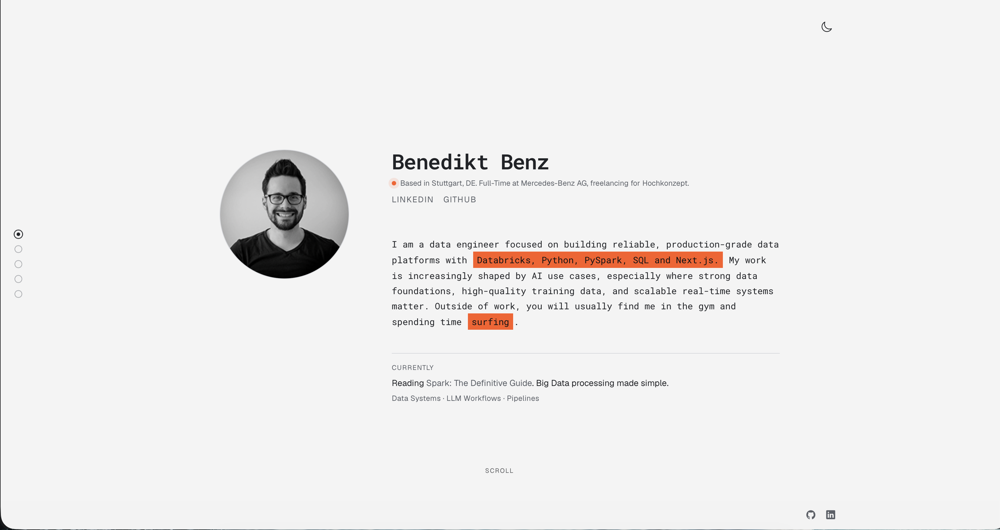
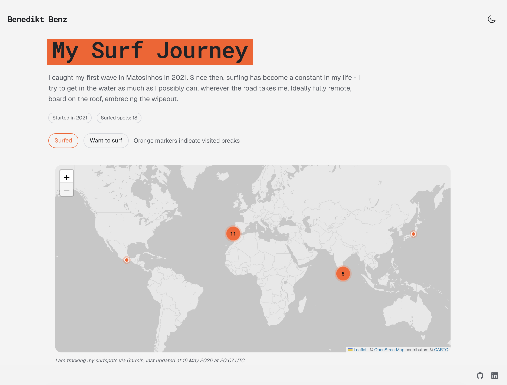
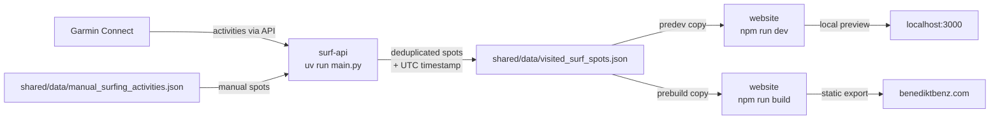

# benediktbenz

Personal portfolio and automated surf tracking, deployed at [benediktbenz.com](https://benediktbenz.com).

[](https://app.netlify.com/projects/benediktbenz/deploys)



## Features

- **Portfolio site** - animated hero, section dot nav, tech stack cards, and contact section
- **Automated surf tracking** - surfing activities pulled directly from Garmin Connect and rendered on an interactive map
- **Surf spot map** - Garmin-backed surf history with a surfed vs. wishlist toggle and marker clustering at all zoom levels
- **Static build pipeline** - spot data flows from the Python script through shared JSON into the Next.js build at deploy time



## Tech Stack

| Layer      | Technology                                    |
| ---------- | --------------------------------------------- |
| Frontend   | Next.js 16, React 19, TypeScript              |
| Styling    | Tailwind CSS 4, Framer Motion                 |
| Maps       | Leaflet, React Leaflet, leaflet.markercluster |
| Surf data  | Python 3.12, python-garminconnect, uv         |
| Deployment | Netlify (static export)                       |

## How It Works



1. **surf-api** authenticates with Garmin Connect, fetches all surfing activities, and merges them with a manual spot list
2. Spots within ~1.1 km of each other are grouped into a single entry
3. The result is written to `shared/data/visited_surf_spots.json` with a UTC extraction timestamp
4. During dev and build, the website copies that file into `public/data/` using `predev` and `prebuild`
5. The surf map reads the JSON at runtime and renders markers on a Leaflet map

## Apps

| App        | Description                                   | Docs                                               |
| ---------- | --------------------------------------------- | -------------------------------------------------- |
| `surf-api` | Garmin activity fetcher and spot deduplicator | [apps/surf-api/README.md](apps/surf-api/README.md) |
| `website`  | Next.js portfolio site                        | [apps/website/README.md](apps/website/README.md)   |

## Repository Structure

```
apps/
  surf-api/   Python script - fetches surf activities from Garmin and writes cleaned spot data
  website/    Next.js portfolio site - reads spot data and renders an interactive surf map
shared/
  data/       JSON files shared between the API output and the website build
```

## License

MIT License. See [LICENCE.md](LICENCE.md) for the full text.
